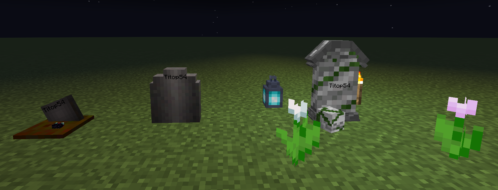
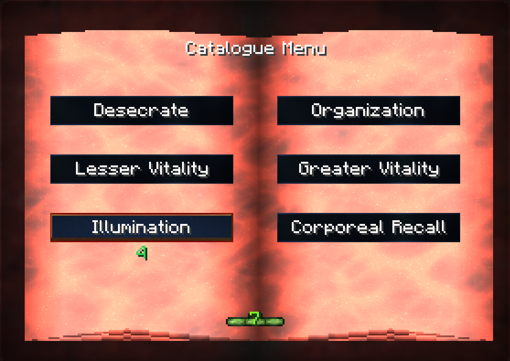
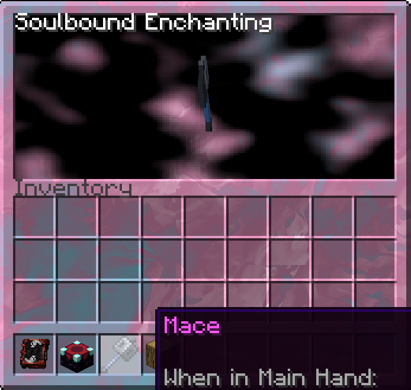
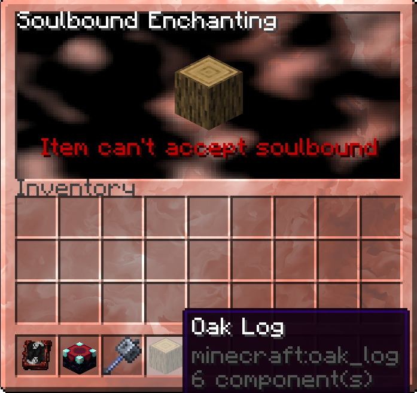

<div align="center">
  <h2></h>Catalyst Graves</h3>
  <p>A simple grave mod that includes different tier of graves, upgrades and more.</p>
  <br>
  <p>Depending on how many upgrades you, you will have different types of graves
  Platform included for each level (it doesn't break blocks unless needed :p )
  </p>
  
  
  <br><br>
  <hr>
  <br>

  <p>While sleeping with a book and quill, you can get a copy of an ancient book
  This book has all the upgrades of the mod, from quick looting to showing where the
  grave is.
  </p>
  

  <br><br>
  <hr>
  <br>

  <p>This mod also includes a soulbound system, where you can have certains tools and armors
  in your inventory after death. This will be shown as blue-ish. You need to hold click
  on the tool to make it spin, and after 2 seconds, it will be enchanted.

  Right click on an enchanting table with the catalogue to open the interface
  </p>
  

  <br><br>
  <hr>
  <br>

  <p>When you select a item that can't be enchanted with soulbound, it will show red-ish</p>
  

  <br>
  <hr>


</div>

There are also some commands utilities for server admins and user, you just need to use: 
```bash
/grave <find|help|recover|restore>
```

If you have Recall advancement, you can sneak right click on the air to tp to your grave, or using the chat command.
Or sneak right click on an ender chest to get a chest or 2 with the items.
